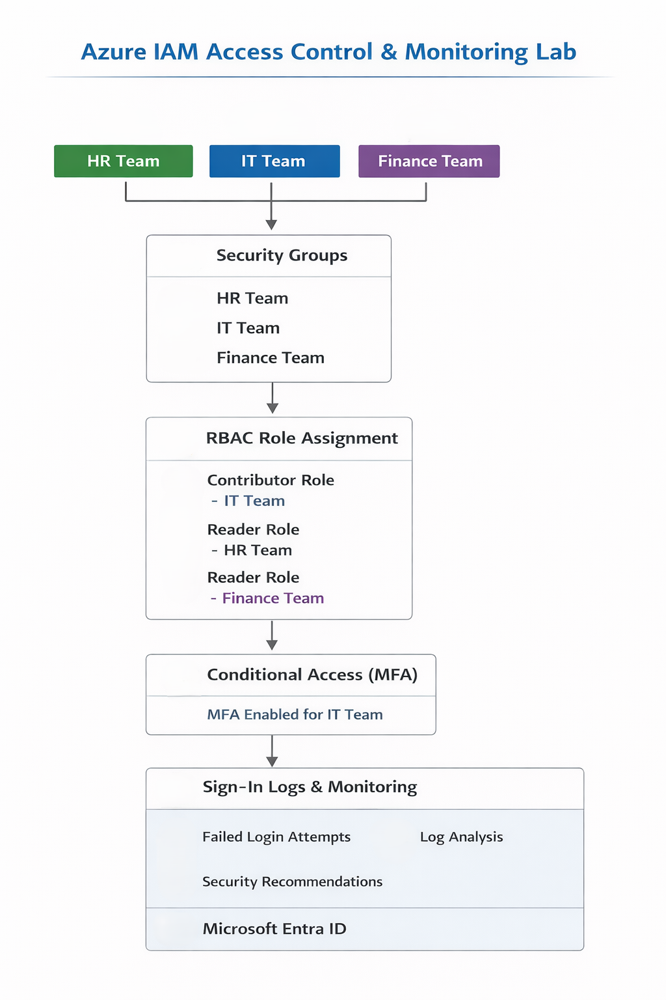
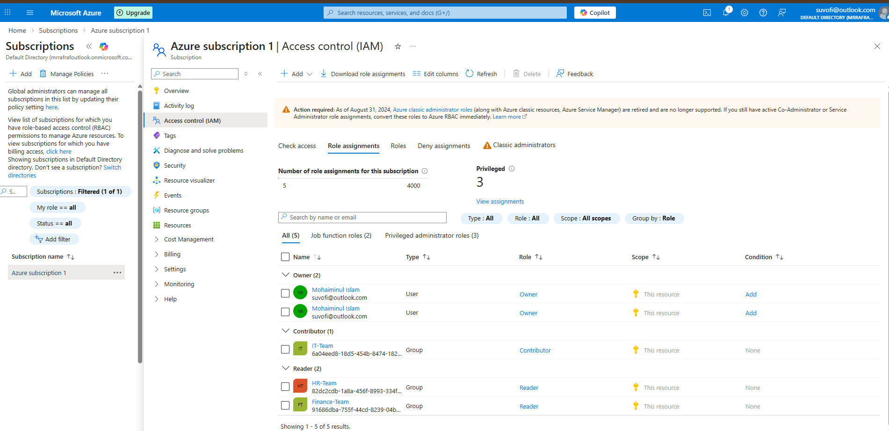
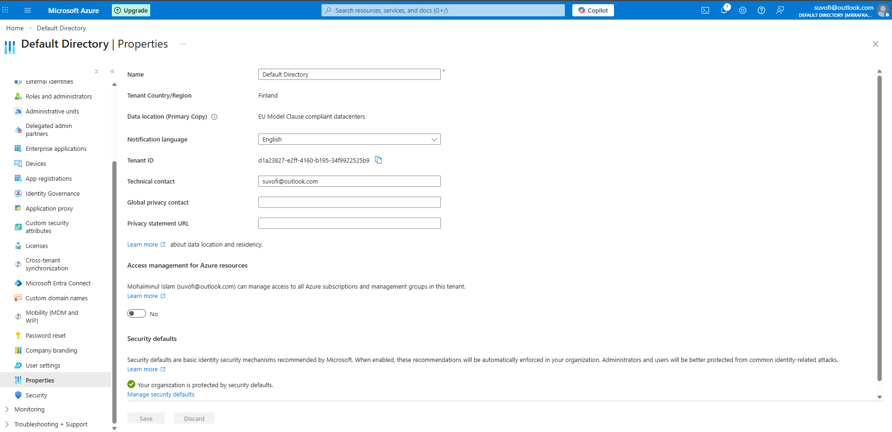
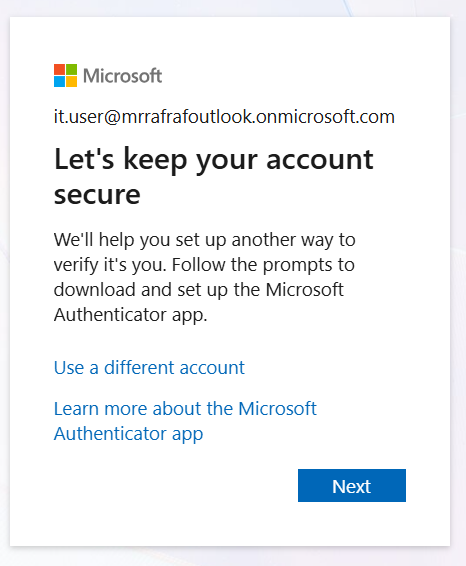
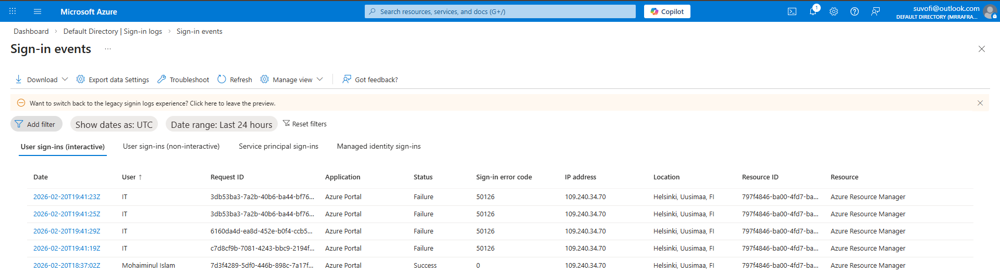

# 🔐 Azure IAM Access Control & Authentication Monitoring Lab

##  Project Overview

This project demonstrates the implementation of Identity and Access Management (IAM) controls in Microsoft Azure (Entra ID). The lab simulates an enterprise environment where role-based access control (RBAC), multi-factor authentication (MFA), and authentication monitoring are configured and analyzed.

The objective was to design a structured identity model, enforce least-privilege access, simulate authentication failures, and investigate sign-in logs from a security monitoring perspective.

---

##  Architecture Design

The lab environment consists of:

- Multiple organizational users (HR, IT, Finance)
- Security groups for access segmentation
- RBAC role assignments at subscription level
- Conditional Access policies enforcing MFA
- Sign-in log monitoring for authentication analysis

### Architecture Diagram

---

## 👥 Identity & Access Structure

### Users Created
- hr.user
- it.user
- finance.user

### Security Groups
- HR-Team
- IT-Team
- Finance-Team

### RBAC Role Assignments
- IT-Team → Contributor
- HR-Team → Reader
- Finance-Team → Reader

RBAC was implemented following the principle of least privilege to minimize unnecessary access rights.

### RBAC Configuration Screenshot

---

## 🔑 Multi-Factor Authentication (MFA) Configuration

To enhance identity security:

- Conditional Access policy was configured
- MFA enforced for IT-Team users
- Authentication flow verified through login testing

### MFA Policy Configuration

### MFA User Prompt During Login

MFA significantly reduces the risk of credential compromise and unauthorized access.

---

## 🚨 Authentication Failure Simulation

To simulate a potential attack scenario:

- Multiple failed login attempts were generated
- Incorrect credentials were intentionally used
- Authentication events were captured in Azure Sign-in Logs

This simulates brute-force or password spraying behavior from a defensive monitoring perspective.

---

## 📊 Sign-In Log Analysis

Authentication logs were analyzed focusing on:

- Failure reason
- Timestamp
- User identity
- IP address
- Authentication status

### Sign-in Logs Analysis Screenshot

### Key Observations

- Repeated failed login attempts were successfully logged
- Authentication status clearly indicated failure reasons
- MFA enforcement was triggered for protected users
- Logging provides visibility into suspicious activity patterns

---

## 🛡️ Security Findings & Recommendations

Based on the lab analysis:

- Implement account lockout thresholds to prevent brute-force attempts
- Enforce MFA for all privileged accounts
- Monitor high-frequency failed sign-in attempts
- Apply conditional access policies based on location and risk level
- Regularly review RBAC role assignments to ensure least privilege

---

## 🎯 Key Skills Demonstrated

- Azure Entra ID (Identity Management)
- Role-Based Access Control (RBAC)
- Conditional Access & MFA Configuration
- Authentication Log Monitoring
- Security Event Analysis
- Security Documentation & Reporting

---

## 📎 Project Outcome

This lab demonstrates practical understanding of enterprise IAM design, access control enforcement, and authentication monitoring. It reflects hands-on experience in securing cloud identities and analyzing login activity from a blue team perspective.

